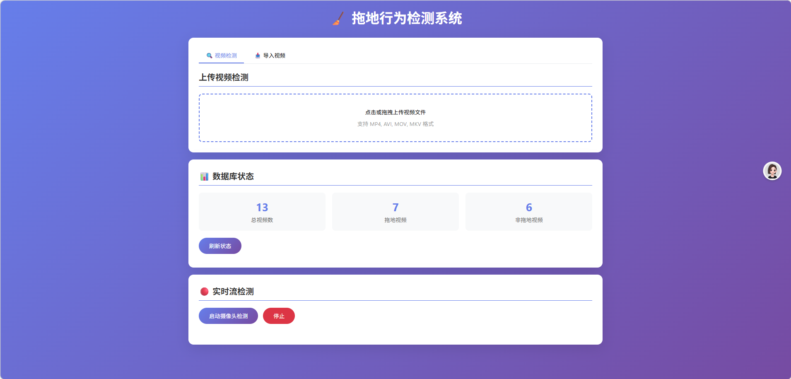

<<<<<<< HEAD
# PoseYOLO - 拖地行为检测系统 v2.0



基于深度学习的视频行为检测系统，通过 ResNet18/50 提取视频特征向量，结合 ChromaDB 向量数据库实现拖地行为的智能识别。

## 项目简介

本项目是一个视频行为识别系统，专门用于检测视频中是否包含拖地行为。系统采用向量相似度匹配的方法，通过对比待测视频与已标注视频的特征相似度来判断行为类型。

### 核心特性

- 基于深度学习的视频特征提取（ResNet18/ResNet50）
- 向量数据库存储与检索（ChromaDB）
- 多种相似度计算方法（余弦/加权/欧氏/KNN）
- 自适应阈值学习
- 支持 INT8 量化加速
- 实时摄像头流检测
- 多线程并行处理
- RESTful API 服务
- Web 可视化界面
- 检测结果导出（CSV/JSON）

## 项目结构

```
PoseYOLO/
├── config.yaml              # YAML 配置文件
├── config.py                # 配置管理类
├── logger.py                # 日志管理器
├── feature_extractor.py     # 视频特征提取器（支持 ResNet18/50）
├── db_manager.py            # 向量数据库管理器
├── action_detector.py       # 行为检测器（含自适应阈值）
├── stream_detector.py       # 实时流检测器 + 并行处理器
├── export_manager.py        # 结果导出管理器
├── api.py                   # FastAPI RESTful 服务
├── utils.py                 # 工具函数
├── main.py                  # 主程序入口
├── detect_mopping.py        # 独立检测脚本
├── add_mopping_videos.py    # 添加拖地视频到数据库
├── add_non_mopping_videos.py # 添加非拖地视频到数据库
├── clear_db.py              # 清空数据库脚本
├── requirements.txt         # 依赖包列表
├── video/                   # 测试视频目录
├── no_video/                # 非拖地视频目录
├── video_embedding_db/      # 向量数据库存储目录
├── logs/                    # 日志目录
└── exports/                 # 导出结果目录
```

## 安装说明

### 环境要求

- Python 3.8+
- CUDA（可选，用于 GPU 加速）

### 安装依赖

```bash
pip install -r requirements.txt
```

### 主要依赖

| 依赖包 | 用途 |
|--------|------|
| torch | 深度学习框架 |
| torchvision | 图像处理与预训练模型 |
| opencv-python | 视频读取与处理 |
| chromadb | 向量数据库 |
| fastapi | Web API 框架 |
| uvicorn | ASGI 服务器 |
| pyyaml | YAML 配置解析 |
| numpy | 数值计算 |

## 配置文件

系统使用 `config.yaml` 进行配置管理，主要配置项：

```yaml
# 设备配置
device:
  type: "auto"  # cuda / cpu / auto

# 模型配置
model:
  backbone: "resnet18"  # resnet18 / resnet50
  quantization:
    enabled: false      # 是否启用 INT8 量化

# 检测配置
detection:
  mopping_threshold: 0.75
  similarity_gap: 0.1
  similarity_method: "cosine"  # cosine / weighted / euclidean / knn

# 自适应阈值
adaptive_threshold:
  enabled: false

# API 配置
api:
  host: "0.0.0.0"
  port: 8000
```

## 使用方法

### 1. 启动 API 服务

```bash
python api.py
```

服务启动后访问：
- API 文档：http://localhost:8000/docs
- Web 界面：http://localhost:8000/ui

### 2. API 接口

#### 单视频检测
```bash
curl -X POST "http://localhost:8000/detect" \
  -H "accept: application/json" \
  -F "file=@test_video.mp4"
```

#### 批量检测
```bash
curl -X POST "http://localhost:8000/detect/batch" \
  -F "files=@video1.mp4" \
  -F "files=@video2.mp4"
```

#### 查看数据库状态
```bash
curl "http://localhost:8000/db/status"
```

#### 添加视频到数据库
```bash
curl -X POST "http://localhost:8000/db/add" \
  -F "file=@mop_video.mp4" \
  -F "action_type=mopping"
```

#### 启动实时流检测
```bash
curl -X POST "http://localhost:8000/stream/start" \
  -H "Content-Type: application/json" \
  -d '{"source": "0"}'
```

### 3. 命令行使用

```python
from config import MoppingDetectionConfig
from action_detector import MoppingActionDetector
from stream_detector import ParallelVideoProcessor

# 初始化配置
config = MoppingDetectionConfig()

# 单视频检测
detector = MoppingActionDetector(config)
is_mopping, mop_sim, non_mop_sim, details = detector.detect("test.mp4")

# 批量并行检测
processor = ParallelVideoProcessor(config)
video_paths = ["video1.mp4", "video2.mp4", "video3.mp4"]
results = processor.submit(video_paths)

# 实时流检测
from stream_detector import VideoStreamDetector
stream = VideoStreamDetector(config)
stream.start_capture(0)  # 0 为默认摄像头
```

### 4. 结果导出

```python
from export_manager import ExportManager

export_manager = ExportManager(config)

# 导出为 CSV
export_manager.export_to_csv(results)

# 导出为 JSON
export_manager.export_to_json(results)

# 同时导出两种格式
export_manager.export(results, format="both")
```

## 技术架构

### 特征提取流程

1. **视频帧读取**：使用 OpenCV 读取视频所有帧
2. **帧采样**：等间距采样 32 帧作为代表
3. **帧预处理**：调整尺寸至 224×224，归一化处理
4. **特征提取**：使用预训练 ResNet18/50 提取特征向量
5. **特征聚合**：对所有帧特征取均值，得到视频级特征
6. **向量标准化**：L2 归一化，便于余弦相似度计算

### 检测算法

支持多种相似度计算方法：

- **余弦相似度**（默认）：`cosine`
- **加权相似度**：`weighted`（时序+空间特征加权）
- **欧氏距离**：`euclidean`
- **KNN**：`knn`（Top-K 平均）

双阈值判定策略：
```
判定为拖地行为需同时满足：
1. 拖地相似度 ≥ threshold
2. 拖地相似度 - 非拖地相似度 ≥ similarity_gap
```

### 自适应阈值

启用后，系统会根据历史检测结果自动调整阈值：

```yaml
adaptive_threshold:
  enabled: true
  learning_rate: 0.01
  target_accuracy: 0.95
```

## 性能优化

### INT8 量化

在配置中启用量化可减小模型体积并加速推理：

```yaml
model:
  quantization:
    enabled: true
    backend: "fbgemm"  # CPU 量化后端
```

### 并行处理

批量检测时自动使用多线程并行处理：

```yaml
parallel:
  enabled: true
  workers: 0  # 0 表示使用 CPU 核心数
  batch_size: 4
```

## 日志系统

系统使用标准 logging 模块记录日志：

```yaml
logging:
  level: "INFO"
  file: "logs/mopping_detection.log"
  console: true
  rotation:
    enabled: true
    max_bytes: 10485760  # 10MB
    backup_count: 5
```

## Web 界面

访问 http://localhost:8000/ui 使用可视化界面：

- 📤 上传视频检测
- 📊 查看数据库状态
- 🔴 实时摄像头检测
- 📈 检测结果可视化

## 许可证

本项目采用 MIT 许可证，详见 [LICENSE](LICENSE) 文件。

Copyright (c) 2026 张允泽
6. **向量标准化**：L2 归一化，便于余弦相似度计算

### 检测算法

采用双阈值判定策略：

```
判定为拖地行为需同时满足：
1. 拖地相似度 ≥ 0.75
2. 拖地相似度 - 非拖地相似度 ≥ 0.1
```

## 安装说明

### 环境要求

- Python 3.8+
- CUDA（可选，用于 GPU 加速）

### 安装依赖

```bash
pip install -r requirements.txt
```

### 主要依赖

| 依赖包 | 用途 |
|--------|------|
| torch | 深度学习框架 |
| torchvision | 图像处理与预训练模型 |
| opencv-python | 视频读取与处理 |
| chromadb | 向量数据库 |
| numpy | 数值计算 |

## 使用方法

### 第一步：添加标注视频到数据库

```python
from config import MoppingDetectionConfig
from db_manager import EmbeddingDBManager

config = MoppingDetectionConfig()
db_manager = EmbeddingDBManager(config)

# 添加拖地视频
mop_videos = ["video/mop_1.mp4", "video/mop_2.mp4"]
db_manager.add_video_embeddings(mop_videos, config.ACTION_MOPPING)

# 添加非拖地视频
non_mop_videos = ["no_video/non_mop_1.mp4", "no_video/non_mop_2.mp4"]
db_manager.add_video_embeddings(non_mop_videos, config.ACTION_NON_MOPPING)
```

### 第二步：检测视频

```python
from config import MoppingDetectionConfig
from action_detector import MoppingActionDetector

config = MoppingDetectionConfig()
detector = MoppingActionDetector(config)

# 执行检测
is_mopping, mop_sim, non_mop_sim = detector.detect("test_video.mp4")

print(f"是否拖地: {is_mopping}")
print(f"拖地相似度: {mop_sim:.3f}")
print(f"非拖地相似度: {non_mop_sim:.3f}")
```

### 快速检测脚本

直接运行独立检测脚本：

```bash
python detect_mopping.py
```

> 使用前需修改脚本中的 `TEST_VIDEO_PATH` 变量

## 配置说明

在 `config.py` 中可调整以下参数：

| 参数 | 默认值 | 说明 |
|------|--------|------|
| DEVICE | auto | 计算设备（cuda/cpu） |
| FRAME_SIZE | (224, 224) | 帧缩放尺寸 |
| SAMPLE_FRAMES | 32 | 采样帧数 |
| DB_PATH | video_embedding_db | 数据库存储路径 |
| MOPPING_THRESHOLD | 0.75 | 拖地相似度阈值 |
| SIMILARITY_GAP | 0.1 | 相似度差值阈值 |
| TOP_K | 1 | 匹配Top-K样本 |

## 核心模块说明

### VideoFeatureExtractor（特征提取器）

负责将视频转换为 512 维标准化特征向量：

- `read_frames()`: 读取视频所有帧
- `sample_frames()`: 等间距采样
- `extract_frame_embedding()`: 提取单帧特征
- `extract_video_embedding()`: 提取视频级特征

### EmbeddingDBManager（数据库管理器）

管理向量数据库的增删查操作：

- `add_video_embeddings()`: 批量添加视频向量
- `query_embeddings()`: 查询相似向量
- `delete_embeddings()`: 删除指定类型数据
- `check_db_status()`: 查看数据库状态

### MoppingActionDetector（行为检测器）

核心检测逻辑实现：

- `calculate_similarity()`: 计算余弦相似度
- `detect()`: 执行行为检测

## 许可证

本项目采用 MIT 许可证，详见 [LICENSE](LICENSE) 文件。

Copyright (c) 2026 张允泽
>>>>>>> 4b61ec534e1da8d84df54dae6a55fbda059a177d
